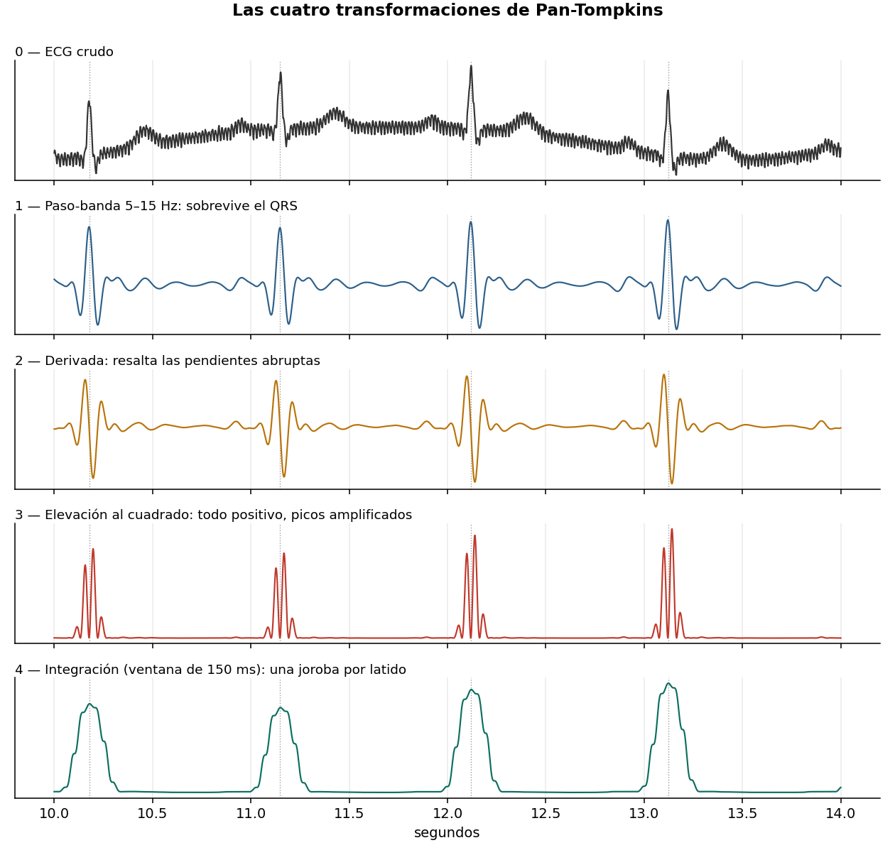
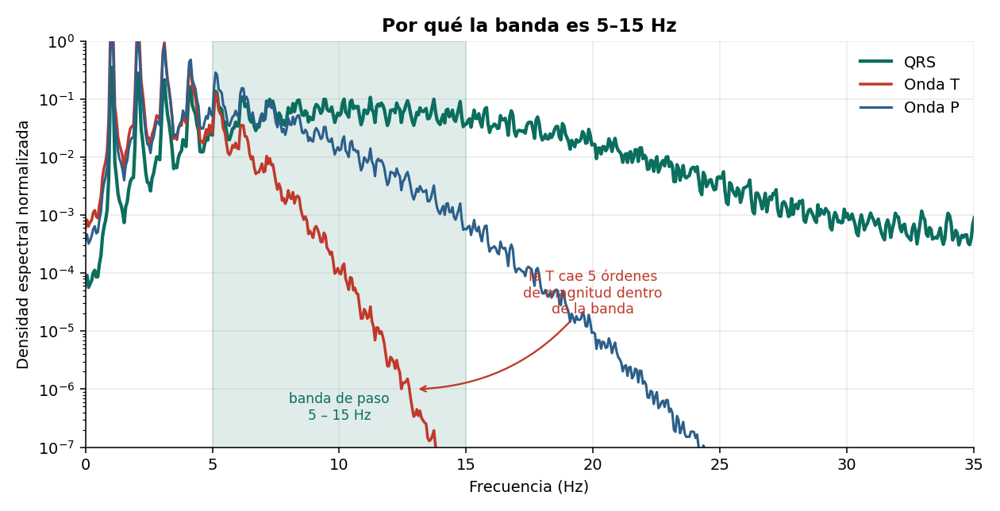
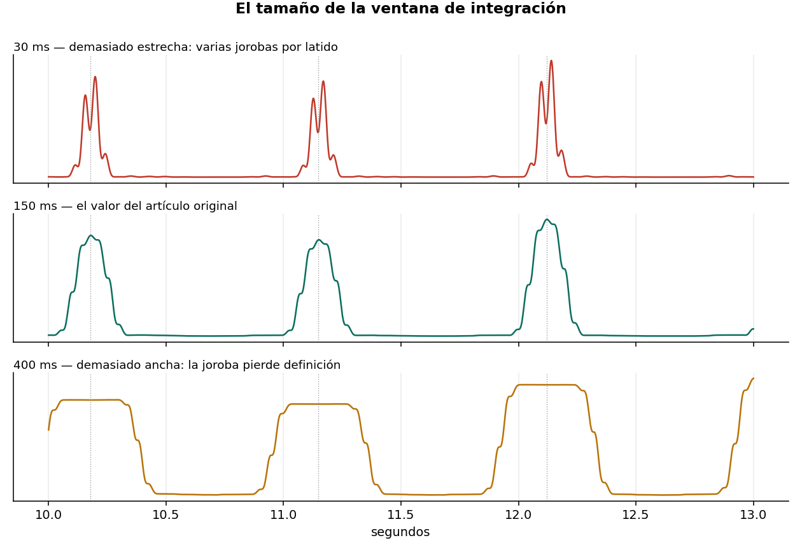

# Las cuatro transformaciones de Pan-Tompkins

Implementación desde cero de la cadena de preprocesamiento del algoritmo Pan-Tompkins
(1985), con medición de por qué cada etapa está donde está.



## Por qué la banda es 5–15 Hz

Midiendo la energía de cada onda del latido por separado:

| Banda (Hz) | QRS | Onda T | Onda P |
|---|---|---|---|
| 0 – 5 | 16.9% | **93.5%** | 68.6% |
| 5 – 15 | **60.6%** | 6.3% | 31.0% |
| 15 – 25 | 20.7% | 0.0% | 0.1% |

La banda no se elige porque ahí esté el QRS, sino porque ahí **domina sobre lo que lo
estorba**: su energía supera casi diez veces a la de la onda T.

En esta señal, 8–20 Hz separaría mejor (367x contra 9.6x). La banda clásica es un
compromiso conservador porque un QRS patológico es más ancho y lento.



## Tamaño de la ventana de integración

| Ventana | Ancho de la joroba | Una joroba por latido |
|---|---|---|
| 30 ms | 83 ms | 95% |
| 50 ms | 110 ms | 100% |
| 150 ms | 196 ms | 100% |
| 400 ms | 446 ms | 100% |

Con 30 ms la ventana no funde los flancos del QRS. Con 400 ms la joroba llega a 446 ms e
invade el latido siguiente: a 140 lpm aparecen fusiones.



## Dónde se rompe la cadena

| Escenario | Jorobas | Latidos | Falsos positivos |
|---|---|---|---|
| T normal (0.30 mV, ancha) | 124 | 124 | 0% |
| T alta pero ancha (0.80 mV) | 124 | 124 | 0% |
| **T picuda (0.80 mV, estrecha)** | **248** | **124** | **50%** |

Lo determinante no es la amplitud sino el ancho:

| Onda T | Energía en 5–15 Hz |
|---|---|
| 0.30 mV, σ = 45 ms | 3.7% |
| 0.80 mV, σ = 45 ms | 3.7% |
| 0.80 mV, σ = 20 ms | **34.5%** |

La onda T picuda es un signo clásico de hiperkalemia. Un detector limitado a estas cuatro
etapas reportaría 124 lpm en un paciente a 62.

**La cadena de transformación no es el detector.** La decisión requiere umbrales
adaptativos, período refractario y discriminación de onda T.

## Contenido

```
notebooks/pan_tompkins_etapas.ipynb   Notebook completo, ejecutable de principio a fin
src/pantom.py                         Las cuatro etapas como funciones independientes
figuras/                              Figuras generadas
```

## Reproducir

```bash
git clone https://github.com/USUARIO/pan-tompkins-etapas.git
cd pan-tompkins-etapas
pip install -r requirements.txt
jupyter lab notebooks/pan_tompkins_etapas.ipynb
```

No requiere descargar datos: la señal se genera dentro del notebook.

## Notas de implementación

Los filtros **no** son los del artículo original. Pan y Tompkins usan coeficientes enteros
diseñados para 200 Hz de muestreo; copiarlos a otra frecuencia produce bandas de paso
equivocadas, error frecuente en implementaciones que circulan en línea. Aquí se diseñan
para la frecuencia real de la señal.

Se usa `sosfiltfilt` en lugar de filtrado unidireccional. El original filtra en una
dirección porque corre en tiempo real; para análisis diferido la fase cero evita
corrimiento y deformación del QRS.

El umbral es fijo, deliberadamente: el umbral adaptativo corresponde a la segunda mitad
del algoritmo.

## Referencias

- Pan J., Tompkins W. *A Real-Time QRS Detection Algorithm.* IEEE Trans. Biomed. Eng., 1985.
- Hamilton P., Tompkins W. *Quantitative investigation of QRS detection rules using the MIT/BIH arrhythmia database.* IEEE Trans. Biomed. Eng., 1986.

## Licencia

MIT — ver [LICENSE](LICENSE).
